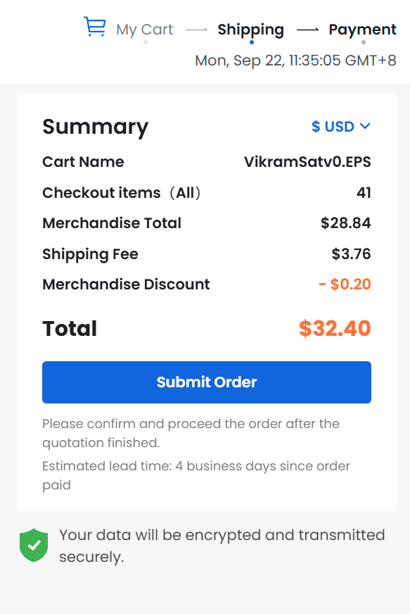

# VikramSat.v0 EPS Journal!!!
 
<h3>Yooooo!!! It's me, Rishaan Sharma, a 14 year old Indian boy making a satellite with 4 of my teammates.
 
The Satellite is named as 'VikramSat'. It's a 2U CubeSat and yeah it's quite a cool project!
 
 
I have been assigned the duty to make a fully functional Electrical Power Sub-System (EPS) for the CubeSat.
 
 
So, I'm writing this journal which notifies about the progress regularly.
 
I hope you all will find this quite interesting. For more details do view JOURNAL.md in this repository containing the journal.</h3>
 
 
<h3>So, you might have gone throught JOURNAL.md, pretty interesting, right? Well, here is the Schematic of the EPS:-</h3>

 
 
<h3>Boom!!! It's Vampire Theme. I hope you like it. Here comes the PCB:-</h3>

 
 
<h3>Well, take a look at the 'Power Monster':-</h3>

 
 
<h3>You wanna see the BOM:-</h3>

 
 
<h3>Here's the Screenshot of the Cart for both LCSC and JLCPCB:-</h3>

 
<h3>I hope you like them, well I couldn't do this better than that, cause I'm just 14!!!</h3>
